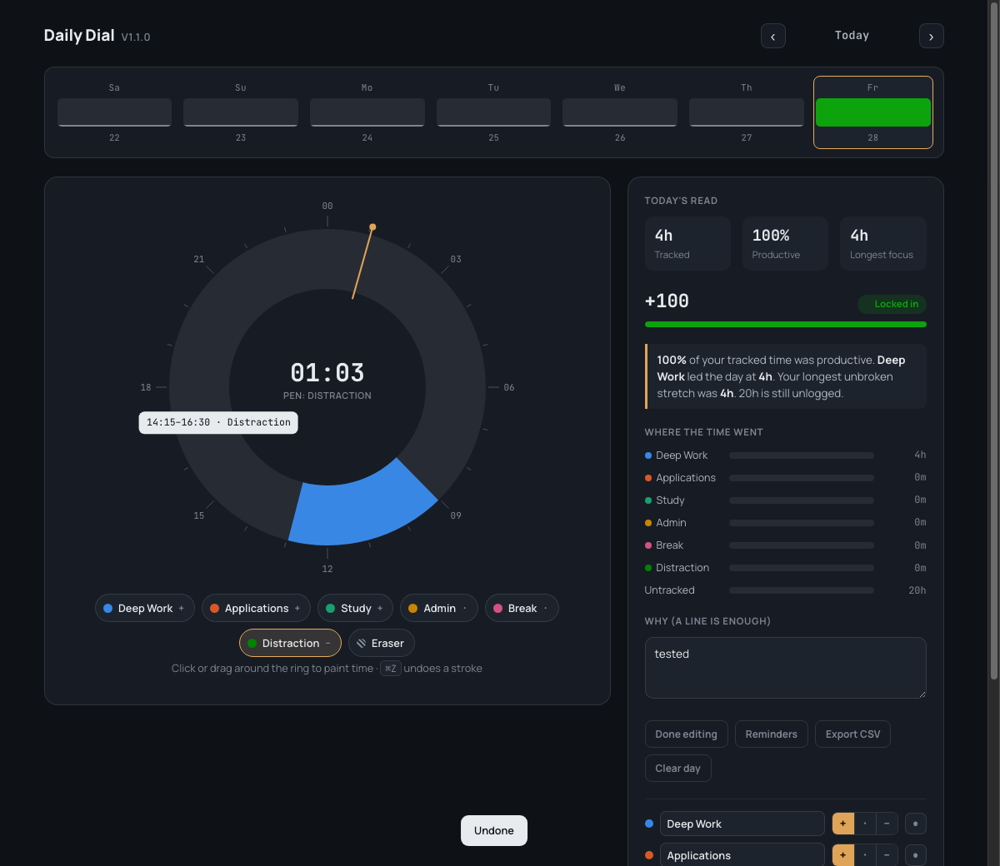

<div align="center">


# Daily Dial

**Paint your day on a 24-hour dial, and see whether the time went where you meant it to.**

[](https://github.com/pranav083/daily-dial-extension/actions/workflows/ci.yml)
[](LICENSE)
[](manifest.json)
[](package.json)
[](#your-data)

[Install](#install) · [How it works](#how-it-works) · [Your data](#your-data) · [Privacy](PRIVACY.md) · [Contributing](CONTRIBUTING.md)



</div>

---

## Why this exists

Most time trackers make you choose between two bad options. Form-based ones ask
for a category, description, date, start time and end time per entry — too slow
to keep up for more than a few days. Automatic ones record which app was in
focus, which can't see a mock interview, a printed textbook, or an hour of
thinking, and quietly reduce your day to window titles.

Daily Dial asks for about ten seconds. Pick a category, drag across the hours you
spent on it, done. It records what you *chose* to do, including everything that
happened away from the keyboard.

It was built for a specific situation — a student splitting time between
coursework and job applications, wanting to know at the end of the day whether
the hours actually went toward the applications.

## Install

No build step, no store account, no payment. The repository *is* the extension.

```bash
git clone https://github.com/pranav083/daily-dial-extension.git
```

1. Open `chrome://extensions`
2. Enable **Developer mode** (top right)
3. Click **Load unpacked** and select the folder
4. Pin it to the toolbar — the icon opens the dial

Prefer a download? Grab the zip from
[Releases](https://github.com/pranav083/daily-dial-extension/releases), unpack
it, and load that folder the same way.

> [!IMPORTANT]
> Chrome derives an unpacked extension's ID from its folder path, and your data
> is keyed to that ID. **Moving the folder later orphans your logged days.**
> Put it somewhere permanent, and export a CSV before relocating it.

## How it works

| | |
|---|---|
| **Paint** | Pick a category, then click or drag around the ring |
| **Erase** | Choose the Eraser pen, or press <kbd>0</kbd>/<kbd>E</kbd>, then drag over a block |
| **Pick a pen** | Click one, or press <kbd>1</kbd>–<kbd>6</kbd> |
| **Type an entry** | `9-11 deep work`, `13:30-15 applications`, `9pm-11pm study` — or your own alias, e.g. `9-11 leetcode` |
| **Category aliases** | Link your own words to a category (Settings → Categories) so typed entries recognize them |
| **Copy yesterday** | Fills today from the previous day; confirms before overwriting |
| **Undo / redo** | <kbd>⌘Z</kbd> / <kbd>⇧⌘Z</kbd> (<kbd>Ctrl+Z</kbd> / <kbd>Ctrl+Shift+Z</kbd>) — 30 deep |
| **Past days** | Arrows beside the date, or click a bar in the week strip |
| **Dial layout** | One 24-hour ring, two 12-hour AM/PM rings side by side, or one 12-hour ring with a switch — pick one via the quick switcher above the dial, or Settings → Appearance |
| **Toolbar badge** | Today's score on the extension icon itself, coloured to match — no click needed |
| **Streaks** | 🔥 counts any day with at least one block; one missed day a week is forgiven |
| **Goals** | Optional per-category targets, daily or weekly, with progress shown in the side panel |
| **Waking hours** | The "still unlogged" nag only counts time inside this window, so sleep isn't mistaken for a gap |
| **Reminders** | Two a day plus an optional weekly recap, all off by default, times are yours |
| **Settings** | Categories, reminders, goals, data, appearance, and about — behind the ☰ button |
| **Export / import** | CSV or a full-fidelity JSON backup; import merges or replaces, your choice |
| **Share as image** | Renders the day — dial, score, top category, streak — as a PNG, built entirely on-device |
| **Google Drive backup** | Optional, off by default — backs up to a private folder in your own Drive; see [PRIVACY.md](PRIVACY.md) |

### The score

Each category carries a weight: `+` counts toward your score, `·` is neutral,
`–` counts against it. The daily score is:

```
(productive − distraction) ÷ tracked
```

It measures the *shape* of a day rather than its length, so a well-spent four
hours beats a scattered ten. Alongside it you get tracked time, productive
percentage, your longest unbroken stretch of focus, and a plain-language read of
the day — the answer to "was I productive?" without having to interpret a chart.

Untracked time is shown rather than hidden, so gaps in logging stay visible
instead of silently flattering your numbers.

### Categories

Six slots, renameable, reweightable, hideable. Days store the slot *index*, not
the name, so renaming a category never rewrites your history.

The defaults assume a job or university search — **Deep Work, Applications,
Study, Admin, Break, Distraction** — with Applications broken out deliberately,
so you can see at a glance whether you actually spent time on applications or
only on studying.

## Your data

Everything stays in `chrome.storage.local`, on your machine.

**No account with us. No server of ours. No analytics.** By default, no
network access of any kind — the extension requests no host permissions, runs
no content scripts, and ships no third-party runtime code. It *cannot* phone
home unless you turn on the one optional exception below.

| Permission | Why |
|---|---|
| `storage` | Save your days, categories, and settings |
| `unlimitedStorage` | Keep years of history past the default quota |
| `alarms` | Schedule the two daily reminders |
| `notifications` | Show them |
| `identity` | Sign in with Google, only if you turn on Drive backup |

Conspicuously absent is `tabs`, which Chrome presents to users as *"read your
browsing history"*. The service worker tracks its own tab through
`chrome.storage.session` instead.

Data survives browser restarts and clearing browsing data, but not deleting your
Chrome profile or the extension. **Export a backup periodically** if the
history matters — CSV opens straight in a spreadsheet, and a JSON backup keeps
everything (days, categories, settings) for a full restore later via
**Settings → Data**. If it's been a couple of weeks since your last export and
you have real history logged, the dial nudges you — dismissible, and it goes
away once you export.

**Optional: Google Drive backup.** Settings → Data also has "Back up to
Google Drive" — off until you connect it, and even then it only ever writes
to a private, app-only folder in your own Drive (`appDataFolder`), invisible
in your regular Drive and unreachable by any other app. It's the only thing
in Daily Dial that sends data anywhere. See [PRIVACY.md](PRIVACY.md) for
exactly what that means, and `docs/GOOGLE_DRIVE_SETUP.md` if you're building
from source and want to enable it yourself.

The full policy is in [PRIVACY.md](PRIVACY.md).

## Known limits

Stated up front, because they're inherent rather than unfinished:

- **Reminders and the weekly recap only fire while Chrome is running.**
  Extensions can't wake a closed browser; that needs a native app.
- **Storage is per-browser-profile.** No cross-device sync, by design — sync
  would mean either a server or a tight quota.
- **15-minute granularity.** The dial has 96 slots; shorter bursts round.

## Development

```bash
npm install     # eslint only — the extension itself has no dependencies
npm test        # 77 unit tests, node's built-in runner
npm run lint
npm run check   # lint + tests + version consistency
npm run package # zip for distribution
```

| Path | Responsibility |
|---|---|
| `manifest.json` | MV3 manifest |
| `dial.html` / `dial.css` | Page shell and styles |
| `dial.js` | Page controller — DOM and `chrome.storage` |
| `lib.js` | All calculation: geometry, stats, CSV, scheduling. No DOM, no `chrome.*` |
| `background.js` | Service worker — reminders, opening the dial |
| `drive.js` | Optional Google Drive backup — `chrome.identity` + `fetch`, no DOM |
| `test/lib.test.js` | Unit tests over `lib.js` |
| `fonts/` | Manrope + JetBrains Mono, bundled (MV3's CSP blocks remote fonts) |

The `lib.js` / `dial.js` split is the one structural rule: anything expressible
as a function from data to data lives in `lib.js`, where it costs nothing to
test, leaving `dial.js` with only the wiring that needs a browser.

See [CONTRIBUTING.md](CONTRIBUTING.md) for setup, conventions that aren't
obvious from the code, and what to check before opening a PR.

## Contributing

Contributions are welcome, including "this was confusing" filed as an issue.
Start with [CONTRIBUTING.md](CONTRIBUTING.md); by participating you agree to the
[Code of Conduct](CODE_OF_CONDUCT.md). Security issues go through
[private reporting](SECURITY.md), not public issues.

## License

[MIT](LICENSE) — do what you like with it.

Fonts are bundled under the [SIL Open Font License](https://openfontlicense.org):
[Manrope](https://github.com/sharanda/manrope) and
[JetBrains Mono](https://github.com/JetBrains/JetBrainsMono).
