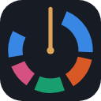
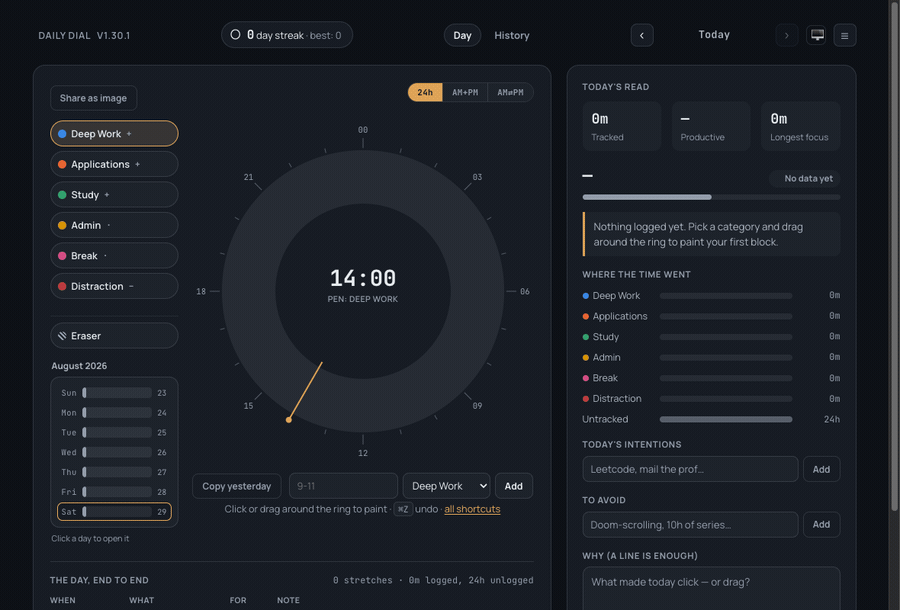

<div align="center">



# Daily Dial

**Paint your day on a 24-hour dial, and see whether the time went where you meant it to.**

[](https://chromewebstore.google.com/detail/daily-dial/mgcjgngceajnmfhkifccaoeccbmfikhn)
[](https://github.com/pranav083/daily-dial-extension/actions/workflows/ci.yml)
[](LICENSE)
[](manifest.json)
[](package.json)
[](#your-data)
[](https://github.com/pranav083/daily-dial-extension/releases/latest)

**[Try it in your browser](https://pranav083.github.io/daily-dial-extension/demo/index.html)** — the real extension, no install, data stays in your browser.

[Website](https://pranav083.github.io/daily-dial-extension/) · [Install](#install) · [How it works](#how-it-works) · [Guides](https://pranav083.github.io/daily-dial-extension/guides/) · [Your data](#your-data) · [Privacy](PRIVACY.md) · [Contributing](CONTRIBUTING.md)



</div>

---

## Why this exists

Most time trackers make you choose between two bad options. Form-based ones ask
for a category, description, date, start time and end time per entry — too slow
to keep up for more than a few days. Automatic ones record which app was in
focus, which can't see a mock interview, a printed textbook, or an hour of
thinking, and quietly reduce your day to window titles.

Daily Dial asks for about ten seconds. Pick a category, drag across the hours you
spent on it, done. It records what you *chose* to do, including everything that
happened away from the keyboard.

It was built for a specific situation — a student splitting time between
coursework and job applications, wanting to know at the end of the day whether
the hours actually went toward the applications.

## Install

**[Install from the Chrome Web Store](https://chromewebstore.google.com/detail/daily-dial/mgcjgngceajnmfhkifccaoeccbmfikhn)** — one click, and it updates itself.

<details>
<summary>Or load it from source</summary>

No build step and no dependencies — the repository *is* the extension.

```bash
git clone https://github.com/pranav083/daily-dial-extension.git
```

1. Open `chrome://extensions`
2. Enable **Developer mode** (top right)
3. Click **Load unpacked** and select the folder
4. Pin it to the toolbar — the icon opens the dial

Prefer a download? Grab the zip from
[Releases](https://github.com/pranav083/daily-dial-extension/releases), unpack
it, and load that folder the same way.

> [!IMPORTANT]
> This applies to unpacked installs only — not the Web Store one. Chrome
> derives an unpacked extension's ID from its folder path, and your data is
> keyed to that ID, so **moving the folder later orphans your logged days.**
> Put it somewhere permanent, and export a CSV before relocating it.

</details>

### Verifying the published build

The store build is the same unminified, dependency-free JavaScript that's in
this repository, so you can check that for yourself rather than taking the
privacy claims on trust. Chrome unpacks installed extensions into a folder
named after the extension ID — `mgcjgngceajnmfhkifccaoeccbmfikhn` — inside your
Chrome profile (`~/Library/Application Support/Google/Chrome/Default/Extensions/`
on macOS, `%LOCALAPPDATA%\Google\Chrome\User Data\Default\Extensions\` on
Windows). Compare it against the matching tag:

```bash
git checkout $(gh release view --json tagName -q .tagName)   # or whichever version you installed
diff -r . "$CHROME_PROFILE/Extensions/mgcjgngceajnmfhkifccaoeccbmfikhn/<version>/"
```

Expect differences only in Chrome's own additions (`_metadata/`) and the files
`npm run package` leaves out. Compare files rather than hashes — `zip` records
modification times, so the archive itself isn't byte-reproducible.

New to Daily Dial? [**Getting started**](docs/GETTING_STARTED.md) walks
through painting your first day, categories and aliases, and backups — with
screenshots. The extension also shows a short version of this itself the
first time you open it.

## How it works

| | |
|---|---|
| **Paint** | Pick a category, then click or drag around the ring |
| **Erase** | Choose the Eraser pen, or press <kbd>0</kbd>/<kbd>E</kbd>, then drag over a block |
| **Pick a pen** | Click one, or press <kbd>1</kbd>–<kbd>6</kbd> |
| **Type an entry** | `9-11 deep work`, `13:30-15 applications`, `9pm-11pm study` — or your own alias, e.g. `9-11 leetcode` |
| **Category aliases** | Link your own words to a category (Settings → Categories) so typed entries recognize them |
| **Copy yesterday** | Fills today from the previous day; confirms before overwriting |
| **Undo / redo** | <kbd>⌘Z</kbd> / <kbd>⇧⌘Z</kbd> (<kbd>Ctrl+Z</kbd> / <kbd>Ctrl+Shift+Z</kbd>) — 30 deep |
| **Past days** | Arrows beside the date, or click a bar in the week strip |
| **History** | A month heatmap, month summary, week-over-week deltas, per-category trends, and search across your notes — the History tab beside Day |
| **Dial layout** | One 24-hour ring, two 12-hour AM/PM rings side by side, or one 12-hour ring with a switch — pick one via the quick switcher above the dial, or Settings → Appearance |
| **Toolbar badge** | Today's score on the extension icon itself, coloured to match — no click needed |
| **Streaks** | 🔥 counts any day with at least one block; one missed day a week is forgiven |
| **Goals** | Optional per-category targets, daily or weekly, with progress shown in the side panel |
| **Waking hours** | The "still unlogged" nag only counts time inside this window, so sleep isn't mistaken for a gap |
| **Reminders** | Two a day plus an optional weekly recap, all off by default, times are yours |
| **Settings** | Categories, reminders, goals, data, appearance, and about — behind the ☰ button |
| **Export / import** | CSV or a full-fidelity JSON backup; import merges or replaces, your choice |
| **Share as image** | Renders the day — dial, score, top category, streak — as a PNG, built entirely on-device |
| **Google Drive backup** | Optional, off by default — backs up to a private folder in your own Drive; see [PRIVACY.md](PRIVACY.md) |

### The score

Each category carries a weight: `+` counts toward your score, `·` is neutral,
`–` counts against it. The daily score is:

```
(productive − distraction) ÷ max(productive + distraction, your daily target)
```

Two things follow from that denominator, and both are deliberate.

**Logging less can never help you.** Where you fall short of the target, the
target is what you are measured against — so two productive hours against a
four-hour target read 50, not 100. An earlier version divided by tracked time
alone, which meant two good hours and an otherwise blank day scored a perfect
100: the arithmetic rewarded precisely the behaviour the tool exists to
discourage.

**Neutral time is free.** A category you have called neither good nor bad sits
outside the fraction entirely, so admitting to an afternoon off costs you
nothing. Distraction still subtracts, because that is how you weighted it.

The target is the sum of your daily goals on productive categories
(Settings → Goals), or four hours if you have not set any — roughly where
sustained focused work tops out. When a typical day drifts well clear of it in
either direction, History says so and suggests moving it.

Alongside the score you get tracked time, productive percentage, your longest
unbroken stretch of focus, and a plain-language read of the day — the answer to
"was I productive?" without having to interpret a chart.

Untracked time is shown rather than hidden, so gaps in logging stay visible
instead of silently flattering your numbers.

### Categories

Six slots, renameable, reweightable, hideable. Days store the slot *index*, not
the name, so renaming a category never rewrites your history.

The defaults assume a job or university search — **Deep Work, Applications,
Study, Admin, Break, Distraction** — with Applications broken out deliberately,
so you can see at a glance whether you actually spent time on applications or
only on studying.

### Languages

Available in **English, Arabic, Chinese (Simplified), French, German, Hindi,
Japanese, Portuguese (Brazil), Russian and Spanish**. By default Chrome picks
whichever matches your browser's language and falls back to English; you can
override that in **Settings → Appearance → Language**, for the case Chrome
cannot cover — a browser set to one language by someone who wants to read this
app in another.

What gets translated is the app's own words — labels, buttons, tooltips, the
score, the sentence under the dial, the observations. **What you write is never
touched.** Your notes, intentions, reflections and category names stay in
whatever language you wrote them in.

Arabic reads right to left, and the layout mirrors with it. The dial does not:
a clock runs clockwise in every language.

Two things stay in English on purpose. **CSV export headers**, because a file
exported on a Hindi install has to import cleanly on an English one — that is
a format, not prose. And the **name "Daily Dial"**, because it is what people
search the store for.

### Guides

Daily Dial names a pattern and stops there — blocking and enforcing are other
tools' jobs, and they do them better. These are the handoff, on the docs site:

- [Make your phone boring](https://pranav083.github.io/daily-dial-extension/guides/boring-phone.html)
  — Assistive Access, Screen Time, greyscale, Digital Wellbeing
- [Block sites during the hours you want to work](https://pranav083.github.io/daily-dial-extension/guides/blocking-sites.html)
- [Protect your best hour](https://pranav083.github.io/daily-dial-extension/guides/best-hour.html)
- [Rest that actually happens](https://pranav083.github.io/daily-dial-extension/guides/rest.html)

Nothing in them is sponsored or affiliated; each tool is named as an example
of an approach.

## Your data

Everything stays in `chrome.storage.local`, on your machine.

**No account with us. No server of ours. No analytics.** By default, no
network access of any kind — the extension requests no host permissions, runs
no content scripts, and ships no third-party runtime code. It *cannot* phone
home unless you turn on the one optional exception below.

| Permission | Why |
|---|---|
| `storage` | Save your days, categories, and settings |
| `unlimitedStorage` | Keep years of history past the default quota |
| `alarms` | Schedule the two daily reminders |
| `notifications` | Show them |
| `identity` | Sign in with Google, only if you turn on Drive backup |

Conspicuously absent is `tabs`, which Chrome presents to users as *"read your
browsing history"*. The service worker tracks its own tab through
`chrome.storage.session` instead.

Data survives browser restarts and clearing browsing data, but not deleting your
Chrome profile or the extension. **Export a backup periodically** if the
history matters — CSV opens straight in a spreadsheet, and a JSON backup keeps
everything (days, categories, settings) for a full restore later via
**Settings → Data**. If it's been a couple of weeks since your last export and
you have real history logged, the dial nudges you — dismissible, and it goes
away once you export.

**Optional: Google Drive backup.** Settings → Data also has "Back up to
Google Drive" — off until you connect it, and even then it only ever writes
to a private, app-only folder in your own Drive (`appDataFolder`), invisible
in your regular Drive and unreachable by any other app. It's the only thing
in Daily Dial that sends data anywhere. See [PRIVACY.md](PRIVACY.md) for
exactly what that means, and `docs/GOOGLE_DRIVE_SETUP.md` if you're building
from source and want to enable it yourself.

The full policy is in [PRIVACY.md](PRIVACY.md).

## Known limits

Stated up front, because they're inherent rather than unfinished:

- **Reminders and the weekly recap only fire while Chrome is running.**
  Extensions can't wake a closed browser; that needs a native app.
- **Storage is per-browser-profile.** No cross-device sync, by design — sync
  would mean either a server or a tight quota.
- **15-minute granularity.** The dial has 96 slots; shorter bursts round.
- **The time fields in Settings follow your browser, not this app.** Chrome
  draws `<input type="time">` itself, from the browser's own locale, and
  ignores the page's language and the app's 12h/24h setting. So those fields
  can read `01:00 PM` while the rest of the app is in another language or set
  to 24-hour. Verified: the `lang` attribute changes nothing, on the input or
  the document. Replacing them with our own controls would fix it and cost
  the native picker; not worth the trade.
- **Translation covers the app, not your writing.** Your notes, intentions,
  reflections and category names stay exactly as you typed them. Nothing you
  wrote is ever machine-translated, and renaming a category you have months of
  data against would be worse than leaving it in English.

## Development

```bash
npm install     # eslint only — the extension itself has no dependencies
npm test        # 215 unit tests, node's built-in runner
npm run lint
npm run check   # lint, tests, and the three consistency guards below
npm run package # zip for distribution
```

`npm run check` runs three guards that exist because each one caught a real
bug that nothing else would have:

- **version** — `manifest.json`, `package.json` and the changelog agree.
- **package** — every module the extension actually imports is in the zip,
  walked from the real import graph rather than a second hand-kept list.
  A module missing from the zip fails at load with a bare resolution error.
- **locales** — every translation has every key, placeholders defined and
  numbered as English numbers them, and each plural family carries the forms
  its language needs (derived from `Intl.PluralRules`, not assumed from
  English's two). Translations fail quietly otherwise: Chrome falls back to
  English, or prints a literal `$COUNT$` to someone who can't read the
  English anyway.

| Path | Responsibility |
|---|---|
| `manifest.json` | MV3 manifest |
| `dial.html` / `dial.css` | Page shell and styles |
| `dial.js` | Page controller — DOM and `chrome.storage` |
| `lib.js` | All calculation: geometry, stats, CSV, scheduling. No DOM, no `chrome.*` |
| `i18n.js` | The only place message keys become words — lookup, plural selection, dates, writing direction |
| `suggestions.js` | What people do about each observation. Bundled data, never fetched |
| `_locales/` | Ten message catalogs, one per language. Generated — edit `translations/` |
| `translations/` | Flat `{key: "words"}` source files translators actually edit |
| `scripts/` | The `npm run check` guards, and `build-locale.mjs` |
| `background.js` | Service worker — reminders, opening the dial |
| `drive.js` | Optional Google Drive backup — `chrome.identity` + `fetch`, no DOM |
| `history.js` | History view controller — heatmap, summaries, trends, note search |
| `historyLib.js` | History's calculations: month grids, week-over-week, trends. No DOM |
| `test/lib.test.js` | Unit tests over `lib.js` |
| `test/historyLib.test.js` | Unit tests over `historyLib.js` |
| `test/i18n.test.js` | Unit tests over `i18n.js`, against the real catalogs |
| `fonts/` | Manrope + JetBrains Mono, bundled (MV3's CSP blocks remote fonts) |

The `lib.js` / `dial.js` split is the one structural rule: anything expressible
as a function from data to data lives in `lib.js`, where it costs nothing to
test, leaving `dial.js` with only the wiring that needs a browser.

That rule is why the pure modules never return a finished sentence. `lib.js`
can't call `chrome.i18n` — it has no `chrome.*` at all, which is what lets 215
tests run under plain node in a fraction of a second — so it returns
`msg("insightTopCategory", cat, dur)` and the UI turns that into words.
Calculation decides *what* is worth saying; `i18n.js` decides in which
language.

See [CONTRIBUTING.md](CONTRIBUTING.md) for setup, conventions that aren't
obvious from the code, and what to check before opening a PR.

## Contributing

Contributions are welcome, including "this was confusing" filed as an issue.
Start with [CONTRIBUTING.md](CONTRIBUTING.md); by participating you agree to the
[Code of Conduct](CODE_OF_CONDUCT.md). Security issues go through
[private reporting](SECURITY.md), not public issues.

## License

[MIT](LICENSE) — do what you like with it.

Fonts are bundled under the [SIL Open Font License](https://openfontlicense.org):
[Manrope](https://github.com/sharanda/manrope) and
[JetBrains Mono](https://github.com/JetBrains/JetBrainsMono).
