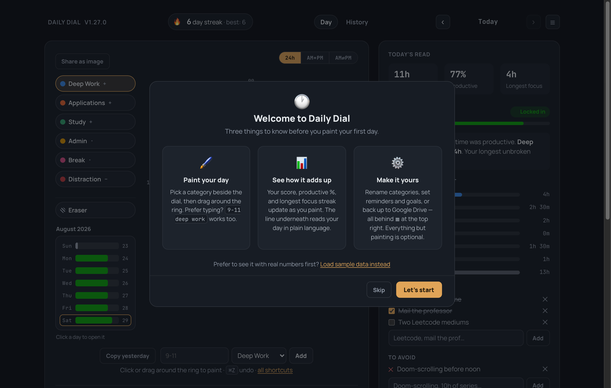
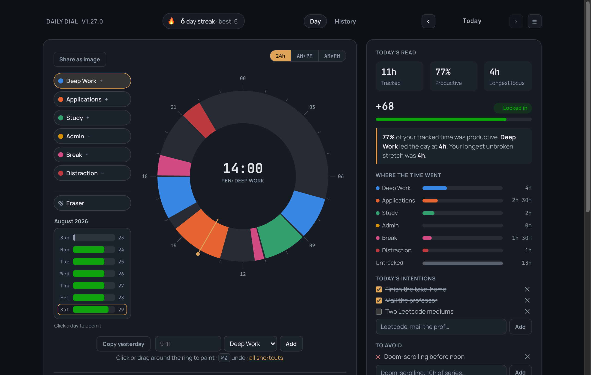
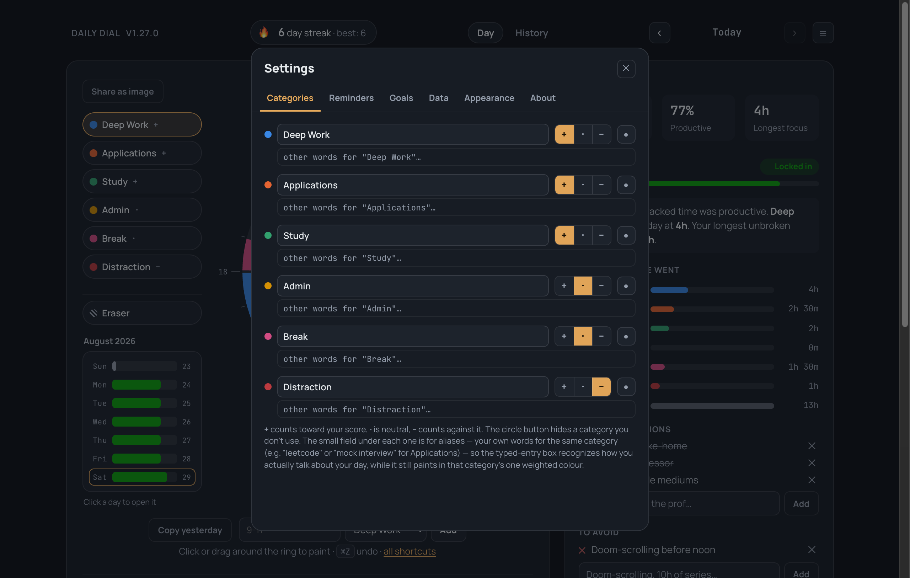
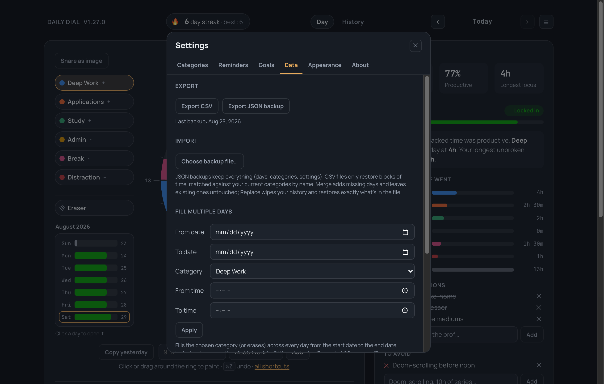

# Getting started

Everything here also appears inside the extension the first time you open it
— this is the same tour, written down, with screenshots.


## Install

**[Install from the Chrome Web Store](https://chromewebstore.google.com/detail/daily-dial/mgcjgngceajnmfhkifccaoeccbmfikhn)** — one click, and it updates itself. Pin it to the toolbar; the icon opens the dial.

Prefer to run it from source? Clone the repo, then:

1. `chrome://extensions` → turn on **Developer mode** (top right)
2. **Load unpacked** → select the `daily-dial-extension` folder
3. Click the Daily Dial icon, or open `chrome://extensions` and hit **Details → Extension options**

## What you'll see on first open

A short welcome screen, once — three cards covering painting, your score, and
where settings live, plus a link under them: **"Prefer to see it with real
numbers first? Load sample data instead"** — one click fills in three weeks
of realistic data and jumps straight to History, if you'd rather explore
before painting anything of your own. Dismiss it normally with **Let's
start** (shows a one-line nudge toward your first block, if the day's still
blank), **Skip**, or by clicking outside it (both of those stay silent). It
won't come back after that on its own — but you can bring it back anytime
from Settings → **About** → **Replay welcome tour**, useful if you're
showing someone else around or just want a refresher.



## Paint your first day

Pick a category from the column beside the dial — **Deep Work**,
**Applications**, **Study**, **Admin**, **Break**, **Distraction** by default —
then click or drag around the ring to paint that stretch of time. The eraser
sits just below them, on its own; it isn't a category, so it doesn't move when
you rename or hide one.

Don't want to drag? Type it instead, in the box under the dial:
```
9-11 deep work
13:30-15 applications
9pm-11pm study
```

Made a mistake? <kbd>Ctrl+Z</kbd> (<kbd>Cmd+Z</kbd> on Mac) undoes one stroke
at a time, thirty deep.

A day painted looks like this — the dial on the left, everything it means on
the right:



- **Score** (top right of the side panel): `(productive − distraction) ÷ tracked`, as a percentage. A focused 4 hours beats a scattered 10.
- **Tracked / Productive / Longest focus**: the three numbers above it.
- **The insight line**: a plain-language read on the day — which category led, whether it came in solid blocks or scattered fragments.
- **Where the time went**: one bar per category, plus **Untracked** — shown on purpose, never hidden, so gaps in your logging stay visible.
- **🔥 streak**, top of the page: consecutive days with at least one block logged. One missed day a week is forgiven.

## Make the categories yours

Settings (**☰**, top right) → **Categories**. Rename any of the six, change
whether it counts toward your score (`+`), against it (`–`), or neither
(`·`), or hide ones you don't use.



The small field under each category is for **aliases** — your own words for
that category, so the typed-entry box recognizes how you actually talk about
your day. Set "leetcode, mock interview" under Applications, and typing
`9-11 leetcode` fills that block as Applications automatically — no need to
remember the category's exact name. Renaming a category never rewrites your
history either way: days store *which slot* you painted, never the name you
gave it.

## Not ready to paint real data yet?

Settings → **About** → **Demo mode** → **Load sample data** fills in three
realistic (fake) weeks — varied scores, a running streak, a couple of
unlogged days — so History's heatmap, streaks, and goals all have something
to show before you've logged anything of your own. Only offered while your
history is genuinely empty (the button disappears the moment you have real
data — nothing gets silently overwritten); **Clear sample data** removes
exactly those days, whenever you're ready to start logging for real. The
same "Demo mode" section also has **Replay welcome tour**, in case you want
another look at the three-card welcome screen.

Two other places offer the same shortcut, right where it's most obviously
useful: the welcome screen itself (see above), and the **History** tab's
empty state, if you open it before logging anything — "Load sample data"
right there fills the heatmap in without leaving the page.

## Back up your data

Settings → **Data**. Two independent ways to keep a copy:



- **Export CSV** — one row per block, opens straight in a spreadsheet.
- **Export JSON backup** / **Choose backup file…** — full-fidelity (days,
  categories, settings); import merges into your existing days or replaces
  them outright, your choice.
- **Google Drive backup** — optional, off until you connect it. Signs in
  with Google and writes to a private folder only this extension can see
  (`appDataFolder`) — invisible in your regular Drive, unreachable by any
  other app. See [PRIVACY.md](../PRIVACY.md) for exactly what that does and
  doesn't send anywhere, and `GOOGLE_DRIVE_SETUP.md` if you're setting this
  up from source.

## The rest, briefly

- **Reminders** (Settings → Reminders): two optional daily nudges and a
  weekly recap, all off until you turn them on.
- **Goals** (Settings → Goals): a daily or weekly minutes target per
  category, with a progress bar.
- **Dial layout** (Settings → Appearance, or the switcher above the dial):
  one 24-hour ring, two 12-hour rings side by side, or one 12-hour ring with
  an AM/PM switch.
- **Share as image**: renders the day — dial, score, streak — as a PNG,
  built entirely on your device.
- **History tab**: a month heatmap, week-over-week comparison, and category
  trends once you've logged a couple of weeks.

That's the whole surface area. Painting is the only thing you ever have to
do — everything else here is optional.
